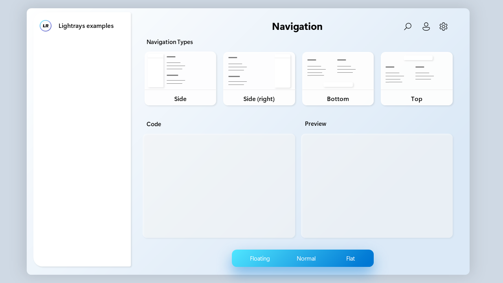

<h1 align="center">Lightrays</h1>

A modern and lightweight web design framework, with normal Website, ReactJS and Sass support.

Demo Website: https://ncoder77.github.io/Lightrays-examples/

 

## Usage
### Without React
Include the following lines in your HTML <head>:  
`
    <link rel='stylesheet' href='https://ncoder77.github.io/Lightrays/style/css/Lightrays.css'>   
    <script src='https://ncoder77.github.io/Lightrays/scripts/Lightrays.js'>
`
For a Demo Website, download the "demo" folder of Lightray-examples repo: https://ncoder77.github.io/Lightrays-examples/
 

### React usage
*Disclaimer: Lightrays for React uses Typescript. You can find a tutorial on how to set up typescript for React here: *
 
For a blank new React App, download the "react-demo" folder of Lightray-examples repo (https://ncoder77.github.io/Lightrays-examples/), and init all npm files (run: npm init) .
 
If you want to use Lightrays in an existing React App, download Lightrays, and copy it into the src folder of your React Application. Next, import the CSS in your App.tsx file:  

` import './Lightrays/css/Lightrays.css'; `

That’s it, you’re ready to go! To use a component, for ex. The Nav, import it in your ts/tsx file:  

` import * as Nav from "./Lightrays/LRNav"; `

 

If you want to try out the Example page, replace <App /> with <ExampleApp /> in the index.tsx.

### Sass support
Lightrays comes with default sass support. To use the sass files, import the sass file: 

` @import "style/scss/Lightrays.scss"; `

 
In your HTML or App.jsx React file, you then just need to include your own css file instead of the Lightrays css file.

## Components
### Overview
LRUtils 
LRNav 
LRBox 

 

### **Developers:**
* [JAcoder7](https://github.com/JAcoder7 "go to his github-accont")
* [Ncoder77](https://github.com/Ncoder77 "go to his github-accont")